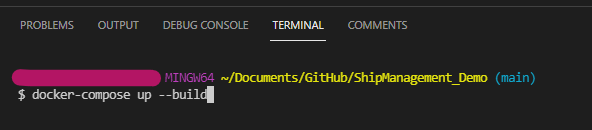

# Ship Management
 Ship Management is an application to perform CRUD operations on ships.
 
 Download the source code. This code contains two projects
1) **ShipManagement**: This is the frontend site made in Angular language.
2) **ShipManagementAPI**: This project is created in Asp.Net Core Web API.
   


 ## Installation

Open the command line prompt and navigate to the code location(where you have to download the code).
There you will see a docker-compose file. This contains the instructions to create a docker container for the application.
Run the following command in the command line.



 ```
docker-compose up
 ```
 
 Firstly, this will install the Nginx server and host the angular application.
 You can access the site using the following URL:
 ```
 http://localhost:3000
 ```
Secondly, it will deploy the Web API core application on the same server under the same network.
You can access the Rest API using the following URL:
```
http://localhost:5005
```

I have also hosted this application on Azure, below is the URL:
```
https://anujangooral-shipmanagement.azurewebsites.net
```

In case you are running the application locally without the docker, then the angular application will try to connect the API at http://localhost:5003. Make sure you run the API as well using the vs code or vs 2019.

**NOTE**: The URL to Web API is configured in the environment.ts file in the angular application.